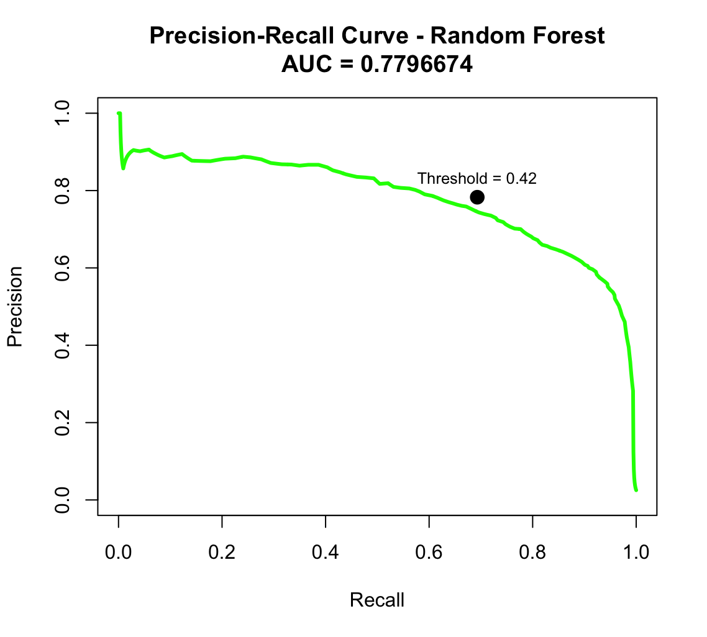

# Results

Model outputs and performance visualizations.

## Folders
- **`EDA-plots`** - Visualizations from exploratory data analysis
- **`cross_validation_output`** - Model tuning from cross-validation for all 6 models
- **`precision_recall_curves`** - Visual comparison of model performance
- **`feature_importance`** - Top predictors of course completion for all 6 models

# Model Performance Results

| Model | Sensitivity | Specificity | Precision | F1-Score | PR-AUC |
|-------|-------------|-------------|-----------|----------|--------|
| **Random Forest** | **0.789** | **0.990** | **0.673** | **0.726** | **0.780** |
| XGBoost | 0.684 | 0.993 | 0.716 | 0.700 | 0.761 |
| Lasso | 0.624 | 0.994 | 0.715 | 0.667 | 0.722 |
| SVM | 0.587 | 0.993 | 0.697 | 0.637 | 0.646 |
| KNN | 0.566 | 0.991 | 0.644 | 0.602 | 0.646 |
| Ridge | 0.517 | 0.994 | 0.699 | 0.594 | 0.684 |

## Key Results

**Winner: Random Forest**
- Best F1-score (0.726) and highest sensitivity (0.789)
- Catches 79% of students who will earn certificates
- Strong overall performance with PR-AUC of 0.780

**Runner-up: XGBoost**
- Second-best F1-score (0.700) and PR-AUC (0.761)
- Trained on subset data - potential for improvement with full dataset

## Threshold Optimization

**Optimal threshold: 0.42** (instead of default 0.5)
- Improved F1-score to 0.737
- Classifies students as "likely to complete" at 42% predicted probability
- Better for catching at-risk students who might succeed with support

	 

## Model Selection

Random Forest chosen because it:
- Maximizes student identification (highest sensitivity)
- Provides interpretable feature importance
- Handles missing data well
- Balances precision and recall effectively
